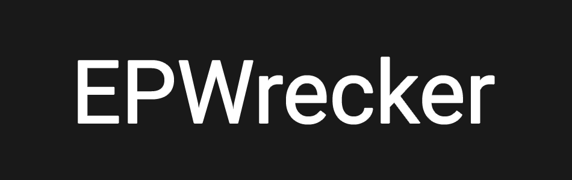

# 

## What's this?
Fetches answers for an **EDPuzzle** video so you don't have to watch the video.

## How do I use this?
1. First, get your EDPuzzle token using an extension such as [EditThisCookie](https://chrome.google.com/webstore/detail/editthiscookie/fngmhnnpilhplaeedifhccceomclgfbg) for Chrome, or [Cookie Quick Manager](https://addons.mozilla.org/en-US/firefox/addon/cookie-quick-manager/) for Firefox.

2. Open the extension in EDPuzzle when you're logged in and look for a cookie called `token`, and copy the value of it. 

3. In your `EPWrecker` src directory make a file called `cookie.txt` and paste in your cookie. 

4. Ensure you have all the NPM modules installed by running `npm install` in the `EPWrecker` src directory, then type `node .` to run it. Paste in your EDPuzzle video ID, which [can be found in the URL](assets/videoid.png).

## Note
Ignore the awful code lol
